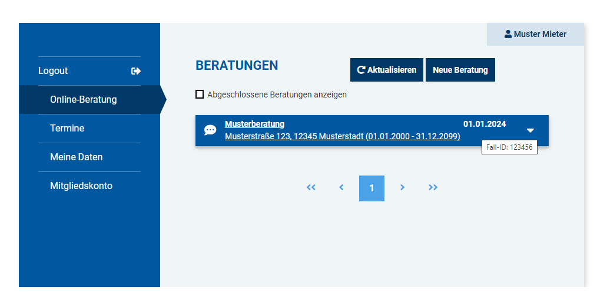

# Mieterverein Fall-ID Revealer
Macht die für Normalsterbliche nicht einsehbare Fall-ID von Onlineberatungen sichtbar.

## Wofür benätigt man die Fall-ID?
Die Fall-ID ist nötig als Referenz wann immer der Mieterverein Ihre Anfragen unbeantwortet schließt. Auch wenn Sie sich auf eine vorheriges Anliegen beziehen möchten dessen Erledigung nur ein vorschneller Trugschein war kann die Fall-ID vonnöten sein.

## Supported:
- [x] Mieterverein Stuttgart
- [ ] ...more to come?

## Installation
1. **Google Chrome**: Install [Tampermonkey](https://chrome.google.com/webstore/detail/tampermonkey/dhdgffkkebhmkfjojejmpbldmpobfkfo) or [Violentmonkey](https://chrome.google.com/webstore/detail/violentmonkey/jinjaccalgkegednnccohejagnlnfdag).  
**Mozilla Firefox**: Install [Greasemonkey](https://addons.mozilla.org/en-US/firefox/addon/greasemonkey/), [Tampermonkey](https://addons.mozilla.org/en-US/firefox/addon/tampermonkey/) or [Violentmonkey](https://addons.mozilla.org/en-US/firefox/addon/violentmonkey/).  
**Opera**: Install [this](https://addons.opera.com/en/extensions/details/install-chrome-extensions/) extension first, then you can install Tampermonkey or Violentmonkey from the Chrome extension store.  
**Microsoft Edge**: Install [Tampermonkey](https://microsoftedge.microsoft.com/addons/detail/tampermonkey/iikmkjmpaadaobahmlepeloendndfphd) from the Edge Add-On Repository.
1. click [here](https://raw.githubusercontent.com/gekkedev/mieterverein-case-id-revealer/main/index.user.js)
1. confirm your intention to install the Userscript.
